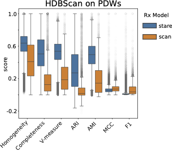
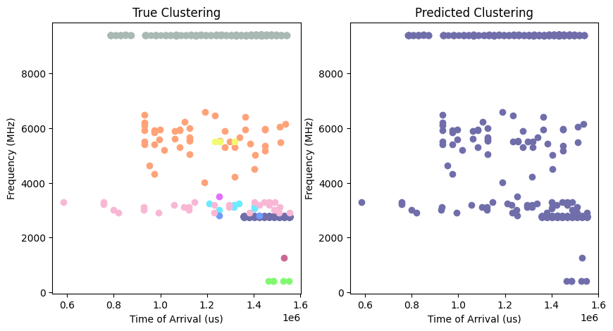
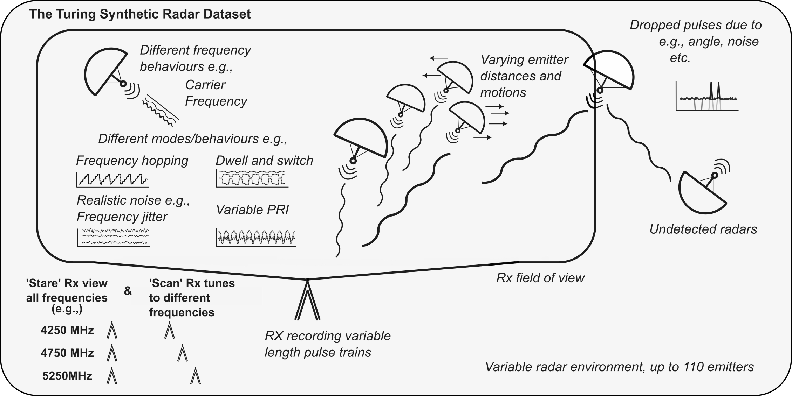
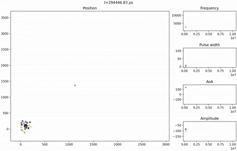
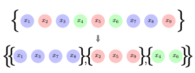

# Turing Deinterleaving Challenge

We present the Alan **T**uring Institute's radar pulse train **D**einterleaving **C**hallenge (TDC). The TDC, together with
our Turing Synthetic Radar Dataset (TSRD), aims to provide the radar research community with a unified benchmark and
dataset, fulfilling the need for data and model comparison. 

If you have developed a model on your own, please share your thoughts with us by contacting 
[Alan Turing Institute Machine Learning for Radio Frequency Interest Group](https://www.turing.ac.uk/research/interest-groups/machine-learning-radio-frequency-applications), 
led by Dr Victoria Nockles <vnockles@turing.ac.uk>. Please also consider sharing performance results of your own model, 
which we aim to consolidate here for comparison. 

> Update Feb 23, 2026: we recently published a new version of the associated dataset as the 
> Turing Synthetic Radar Dataset (TSRD). The repository is updated accordingly. If you found our work useful for your 
> own research, please consider citing:
> 
> *Gunn, E., Hosford, A., Jones, R., Zeitler, L., Groves, I., & Nockles, V. (2026). The Turing Synthetic Radar Dataset: 
> A dataset for pulse deinterleaving. arXiv preprint arXiv:2602.03856.*

```@article{gunn2026turing,
  title={The Turing Synthetic Radar Dataset: A dataset for pulse deinterleaving},
  author={Gunn, Edward and Hosford, Adam and Jones, Robert and Zeitler, Leo and Groves, Ian and Nockles, Victoria},
  journal={arXiv preprint arXiv:2602.03856},
  year={2026}
}
```

## Leader Board
We provide a default baseline model for which we apply HDBscan directly on the raw PDWs of the *stare* and *scan*
test set. Please find the associated notebook for the analysis in `examples/identity_model.ipynb`. If you have developed
a new deinterleaving model which makes use of the TSRD with published results, please consider getting in touch with us
(<vnockles@turing.ac.uk>)! We'll add your results and reference your paper on our GitHub page.


| **Model name** | **Rx type** | **V-measure** | **ARI** | **AMI** | **Homogeneity** | **Completeness** | **MCC** | **F1** |
|----------------|-------------|---------------|---------|---------|-----------------|------------------|---------|--------|
| **HDBSCAN**    | *Stare*     | 0.538         | 0.270   | 0.496   | 0.638           | 0.504            | 0.057   | 0.010  |
|                | *Scan*      | 0.187         | 0.017   | 0.146   | 0.409           | 0.127            | 0.071   | 0.037  |




## Table of Contents

- [Technical Background](#technical-background)
  - [Radar Pulse Deinterleaving Problem](#radar-pulse-deinterleaving-problem)
  - [Pulse Descriptor Words (PDWs)](#pulse-descriptor-words-pdws)
  - [Deinterleaving Approaches](#deinterleaving-approaches)
  - [Challenge Context](#challenge-context)
- [Installation](#installation)
  - [Recommended Environment Setup](#recommended-environment-setup)
  - [Install the Package](#install-the-package)
- [Usage](#usage)
  - [Loading the Dataset](#loading-the-dataset)
  - [Visualise the Data](#visualise-the-data)
  - [Directory Structure](#directory-structure)
  - [Important Class/Function Locations](#important-classfunction-locations)
- [Contributing](#contributing)
- [License](#license)

## Technical Background

### Radar Pulse Deinterleaving Problem

Radar deinterleaving is a critical signal processing task in electronic warfare, surveillance, and radar signal intelligence applications. When multiple radar emitters operate simultaneously within the same electromagnetic environment, their transmitted pulses become interleaved in time, creating complex pulse trains that must be separated and attributed to their originating sources.

The radar pulse deinterleaving problem involves separating radar pulses from multiple unknown emitters present in a single recorded pulse train. This separation task is particularly challenging because:

- The number of active emitters is typically unknown a priori
- Pulse patterns may be irregular or adaptive
- Environmental factors introduce noise and measurement uncertainty
- Real-time processing constraints limit computational complexity


Let $X = \lbrace x_{1}, x_{2}, \dots,x_{n} \rbrace$ represent a pulse train containing n pulses from N unknown emitters. The deinterleaving task seeks to partition $X$ into N disjoint subsets:

$$X = \lbrace U_{1},\dots U_{N} \rbrace$$

where each subset $U_{i}$ contains all pulses originating from emitter i.

<p align="center">
    
</p>

*Figure 1: Schematic illustration of the radar pulse deinterleaving problem, showing how interleaved emitters can be clustered by emitter with feature vector $x_{i}$.* 

### Pulse Descriptor Words (PDWs)

A Pulse Descriptor Word (PDW) is a multi-dimensional feature vector that characterizes the measurable parameters of a radar pulse. PDWs serve as the fundamental input for deinterleaving algorithms, providing quantitative descriptions of pulse characteristics.

The standard PDW parameters used in this challenge include:

#### Time of Arrival (ToA)

- **Definition**: Timestamp when the pulse leading edge is detected
- **Units**: Microseconds ($\mu s$)
- **Significance**: Enables temporal pattern analysis and pulse repetition interval (PRI) estimation

#### Centre Frequency (CF)

- **Definition**: Carrier frequency of the radar pulse
- **Units**: Megahertz (MHz) or Gigahertz (GHz)
- **Significance**: Primary discriminator for frequency-agile or fixed-frequency emitters

#### Pulse Width (PW)

- **Definition**: Duration of the pulse envelope
- **Units**: Microseconds ($\mu s$)
- **Significance**: Indicates radar type and operational mode

#### Angle of Arrival (AoA)

- **Definition**: Spatial direction from which the pulse arrives
- **Units**: Degrees (°) or radians
- **Significance**: Provides spatial discrimination between emitters

#### Amplitude/Power

- **Definition**: Peak or integrated power level of the received pulse
- **Units**: Decibels (dB) or linear scale
- **Significance**: Relates to emitter power and propagation distance

<p align="center">
    
</p>

*Figure 2: Example clustering problem comparing frequency with ToA. Generated by running '''demo.ipynb'''* 


### Deinterleaving Approaches

#### Traditional Methods

- **Histogram-based**: Analyze statistical distributions of PDW parameters (PRI histograms, frequency clustering)
- **Sequence-based**: Exploit temporal ordering and pattern recognition (PRI sequence matching, Markov models)
- **Clustering**: Unsupervised learning approaches (K-means, DBSCAN, hierarchical clustering)

#### Modern Deep Learning Approaches

Recent advances leverage transformer architectures for deinterleaving using metric learning approaches:

- **Sequence-to-sequence models**: Process entire pulse trains simultaneously
- **Self-attention mechanisms**: Capture long-range dependencies between pulses
- **Triplet loss training**: Optimizes embedding similarity within emitters and dissimilarity between emitters
- **Synthetic data generation**: Creates controlled training scenarios with known ground truth

Performance is typically evaluated using clustering metrics such as **V-measure** (the primary evaluation metric for this challenge), Adjusted Mutual Information (AMI), and silhouette coefficients.

### Challenge Context

This challenge is inspired by recent research including "Radar Pulse Deinterleaving with Transformer Based Deep Metric Learning" (arXiv:2503.13476), which demonstrates transformer-based approaches achieving 0.882 adjusted mutual information score on synthetic radar pulse data using 5-dimensional PDWs.

## Installation
### Interface
The TDC version 1.3 was developed and tested on `python=3.13` but any version  >=3.10 should work. If you face any 
problems with during the installation, please report an issue. 

After creating virtual environment, install the package from source via

```commandline
python3 -m pip install git+https://github.com/alan-turing-institute/turing-deinterleaving-challenge.git
```

If you want to install the TDC in developer mode, activate your virtual environment and install it by cloning 
the repository and installing it directly via

```commandline
git clone https://github.com/alan-turing-institute/turing-deinterleaving-challenge.git && cd turing-deinterleaving-challenge 
python3 -m pip install -e ".[dev]"
```

For running the jupyter notebook demo, please also run

```commandline
python3 -m pip install -e ".[demo]"
```

### Data Download
The data is available on HuggingFace and can be downloaded directly here: [https://huggingface.co/datasets/alan-turing-institute/turing-deinterleaving-challenge](https://huggingface.co/datasets/alan-turing-institute/turing-deinterleaving-challenge). 
If you have a HuggingFace token that 
provides larger API request limits, we recommend using it. If not, there might be a timeout when downloading the dataset (it is big). 
If you're running into a timeout or limited API call issue, it resumes when simply running the download again. 
Due to the dataset size, you might need to repeat several times. Alternatively, you can use the API by running

```python
from pathlib import Path
from turing_deinterleaving_challenge import download_dataset
subset_list = ["train", "validation", "test"]
hf_token_path = "path/to/hf/token.txt" # path to huggingface token
with open(hf_token_path, "r") as hf_file:
    hf_token = hf_file.read()  # read in token file

save_dir = Path("../data")
train_set_path = download_dataset(
    save_dir=save_dir,
    subsets=subset_list,
    hf_token=hf_token
)
```

Remember that you might need to run the command several times if you don't have a HuggingFace token before the dataset 
is fully downloaded. You can alternatively set your HuggingFace token as an `env` variable. Our interface will load your 
token automatically. To do so, copy .env.example as .env
```commandline
cp .env.example .env
```
Then, [generate a huggingface token](https://huggingface.co/settings/tokens) and place it in the .env.

## Data description

The dataset is composed of six sub-datasets, train, validation, and test for two receiver modes, each of which contain 
simulated interleaved pulse trains. The dataset represents the emitted ground truth of the ElectroMagnetic Environment (EME), 
rather than specifically modelling realistic receiver models. Therefore, the dataset is independent of an individual 
receiver type, and focuses instead on the superposition of realistic emitters. Note that the dataset is not suited for
specific emitter identification model development, as it does not include hardware-specific noise. However, parameter 
ranges for pulse emissions were gleaned from publicly available sources.

Pulses were realistically simulated using a single static emitter which could either observe the entire frequency 
spectrum at once (_stare_) or which is sweeping through at deterministic intervals (_scan_). _Stare_ mode can be understood
as an oracle receiver that can observe the entire EME (except randomly dropped pulses), whereas _scan_ simulates more realistic
receiver setups.

Emitters were static or mobile on a two-dimensional plane, but can only move along straight lines with constant velocity.
Both datasets (i.e. _scan_ and _stare_) were created using the same transmitter configuration. Received pulses are 
represented as Pulse Descriptor Words (PDWs) to reduce storage and memory consumption. Each PDW 
consists of the Time of Arrival (ToA), Centre Frequency (CF), Pulse Width (PW),
Angle of Arrival (AoA), and Amplitude (more information about PDWs below).



Each pulse train is saved as `h5` file which contains the stream of PDWs, arbitrary emitter labels, and pulse train metadata.
You can easily load an access these properties by running

```python
from turing_deinterleaving_challenge import PulseTrain
pt_path = "path/to/pulse/train.h5"

pt = PulseTrain.load(pt_path)
pdw_stream = pt.data
emitter_labels = pt.labels
meta_data = pt.metadata
```

Similar emitter types were used in several simulations but with different configurations to model independent scenarios.
**We stress that emitter labels are arbitrary numbers, and are only consistent with respect to the same pulse train**. 
Consequently, label `1` in the first pulse train file might be a different emitter than the same label `1` in a 
different pulse train. Your model and loss function needs to account for this if you use batching.


### Dataset Stats
We refer to our paper for the overall dataset summary statistics. Overall, we produced more than 4bn pulses over both receiver modes.

|  **Rx**     | **Metric**      | **Train**      | **Val**       | **Test**      | **All**      |
|-------------|-----------------|----------------|---------------|---------------|--------------|
|  _stare_    | n trains        | 2,500          | 250           | 250           | 3,000        |
|             | Total pulses    | 3.17B          | 316.7M        | 367.5M        | 3.86B        |
|             | Max pulses      | 5.76M          | 5.92M         | 4.38M         | 5.92M        |
|             | Min pulses      | 0              | 91            | 1,587         | 0            |
|             | Mean pulses     | 1.27M          | 1.27M         | 1.47M         | 1.29M        |
|             | Max emitters    | 83             | 77            | 85            | 85           |
|             | Min emitters    | 0              | 1             | 1             | 0            |
|             | Mean emitters   | 36.7           | 36.0          | 43.3          | 37.2         |
|  _scan_     | n trains        | 2,500          | 250           | 250           | 3,000        |
|             | Total pulses    | 233.2M         | 22.7M         | 27.0M         | 282.8M       |
|             | Max pulses      | 390.5K         | 505.1K        | 354.8K        | 505.1K       |
|             | Min pulses      | 0              | 4             | 103           | 0            |
|             | Mean pulses     | 93.3K          | 90.8K         | 107.9K        | 94.3K        |
|             | Max emitters    | 85             | 79            | 90            | 90           |
|             | Min emitters    | 0              | 1             | 1             | 0            |
|             | Mean emitters   | 38.1           | 37.1          | 44.3          | 38.5         |


### What are Pulse Descriptor Words (PDWs)

A Pulse Descriptor Word (PDW) is a multi-dimensional feature vector that characterizes the measurable parameters of a 
radar pulse. PDWs serve as the fundamental input for deinterleaving algorithms, providing quantitative descriptions 
of pulse characteristics.

The standard PDW parameters used in this challenge include:

#### Time of Arrival (ToA)

- **Definition**: Timestamp when the pulse leading edge is detected
- **Units**: Microseconds ($\mu s$)
- **Significance**: Enables temporal pattern analysis and pulse repetition interval (PRI) estimation

#### Centre Frequency (CF)

- **Definition**: Carrier frequency of the radar pulse
- **Units**: Megahertz (MHz) or Gigahertz (GHz)
- **Significance**: Primary discriminator for frequency-agile or fixed-frequency emitters

#### Pulse Width (PW)

- **Definition**: Duration of the pulse envelope
- **Units**: Microseconds ($\mu s$)
- **Significance**: Indicates radar type and operational mode

#### Angle of Arrival (AoA)

- **Definition**: Spatial direction from which the pulse arrives
- **Units**: Degrees (°) or radians
- **Significance**: Provides spatial discrimination between emitters

#### Amplitude/Power

- **Definition**: Peak or integrated power level of the received pulse
- **Units**: Decibels (dB) or linear scale
- **Significance**: Relates to emitter power and propagation distance
- 
## Technical Background

### Radar Pulse Deinterleaving Problem

Radar deinterleaving is a critical signal processing task in electronic warfare, surveillance, and radar signal intelligence applications. When multiple radar emitters operate simultaneously within the same electromagnetic environment, their transmitted pulses become interleaved in time, creating complex pulse trains that must be separated and attributed to their originating sources.

The radar pulse deinterleaving problem involves separating radar pulses from multiple unknown emitters present in a single recorded pulse train. This separation task is particularly challenging because:

- The number of active emitters is typically unknown a priori
- Pulse patterns may be irregular or adaptive
- Environmental factors introduce noise and measurement uncertainty
- Real-time processing constraints limit computational complexity


Let $X = \lbrace x_{1}, x_{2}, \dots,x_{n} \rbrace$ represent a pulse train containing n pulses from N unknown emitters. The deinterleaving task seeks to partition $X$ into N disjoint subsets:

$$X = \lbrace U_{1},\dots U_{N} \rbrace$$

where each subset $U_{i}$ contains all pulses originating from emitter i.

<p align="center">
    
</p>

*Figure 1: Schematic illustration of the radar pulse deinterleaving problem, showing how interleaved emitters can be clustered by emitter with feature vector $x_{i}$.* 


<p align="center">
    
</p>

*Figure 2: Example clustering problem comparing frequency with ToA. Generated by running '''demo.ipynb'''* 


### Deinterleaving Approaches

#### Traditional Methods

- **Histogram-based**: Analyze statistical distributions of PDW parameters (PRI histograms, frequency clustering)
- **Sequence-based**: Exploit temporal ordering and pattern recognition (PRI sequence matching, Markov models)
- **Clustering**: Unsupervised learning approaches (K-means, DBSCAN, hierarchical clustering)

#### Modern Deep Learning Approaches

Recent advances leverage transformer architectures for deinterleaving using metric learning approaches:

- **Sequence-to-sequence models**: Process entire pulse trains simultaneously
- **Self-attention mechanisms**: Capture long-range dependencies between pulses
- **Triplet loss training**: Optimizes embedding similarity within emitters and dissimilarity between emitters
- **Synthetic data generation**: Creates controlled training scenarios with known ground truth

Performance is typically evaluated using clustering metrics such as **V-measure** (the primary evaluation metric for this challenge), Adjusted Mutual Information (AMI), and silhouette coefficients.

```bash
└── src
    └── turing_deinterleaving_challenge
       ├── data
       │   ├── dataset.py
       │   ├── load.py
       │   └── structure.py
       ├── models
       │   ├── evaluate.py
       │   └── model.py
       └── visualisation
            └── visualisations.py
```
#### Important class/function locations
* ```data/dataset.py``` contains the principal data class, ```DeinterleavingChallengeDataset```.
* ```data/load.py``` defines a helper function ```download_dataset``` which downloads the challenge data from the Huggingface hub to a local directory, saving in the .h5 format.
* ```data/structure.py``` defines the ```PulseTrain``` class, with various methods for saving & loading of the data in scripts.

### Important Class/Function Locations

- `data/dataset.py` contains the principal data class, `DeinterleavingChallengeDataset`.
- `data/load.py` defines a helper function `download_dataset` which downloads the challenge data from the Hugging Face hub to a local directory, saving in the `.h5` format.
- `data/structure.py` defines the `PulseTrain` class, with various methods for saving and loading the data in scripts.
- `models/model.py` defines the Abstract Base Class that your model solution must wrap into.
- `models/evaluate.py` contains functions to evaluate your challenge model on the ground truth emitter labels. `evaluate_labels` in particular computes **V measure**, which is the principal evaluation metric of the challenge.
- `visualisation/visualisations.py` contains useful functions for plotting the PDW data in a structured way.

* ```visualisation/visualisations.py``` contains useful functions for plotting the PDW data in a structured way.

## Contributing

See [CONTRIBUTING.md](CONTRIBUTING.md) for instructions on how to contribute.

## License

Distributed under the terms of the [Apache license](LICENSE).


<!-- prettier-ignore-start -->
[actions-badge]:            https://github.com/egunn-turing/turing-deinterleaving-challenge/workflows/CI/badge.svg
[actions-link]:             https://github.com/egunn-turing/turing-deinterleaving-challenge/actions
[pypi-link]:                https://pypi.org/project/turing-deinterleaving-challenge/
[pypi-platforms]:           https://img.shields.io/pypi/pyversions/turing-deinterleaving-challenge
[pypi-version]:             https://img.shields.io/pypi/v/turing-deinterleaving-challenge
<!-- prettier-ignore-end -->